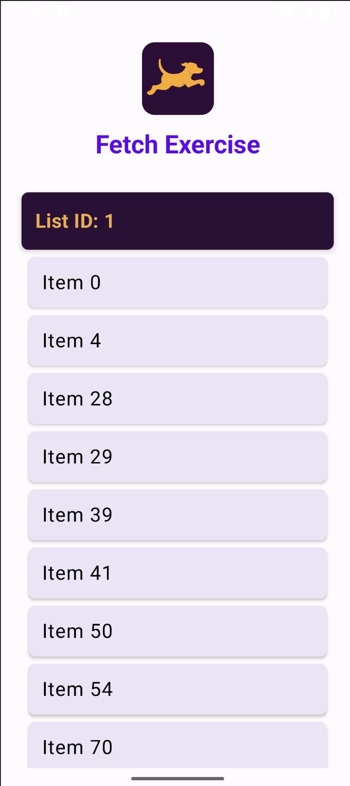
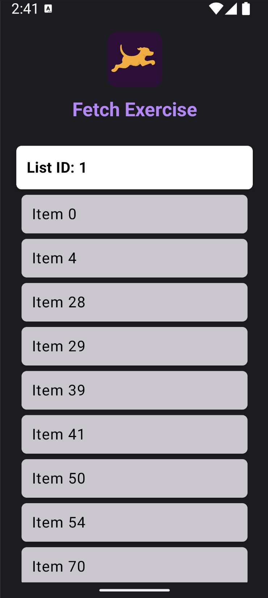

# FetchRewardsApp
📱 **A Native Android App for Fetch Rewards Coding Exercise**

## 📌 Overview
This is a **native Android app** written in **Kotlin**, which retrieves and displays data from URL which was sent for exercise.

The app processes the data and displays it in a **sorted, structured list**, following these requirements:  
✔️ **Group items by `listId`**  
✔️ **Sort by `listId` first, then `name`**  
✔️ **Filter out blank or `null` names**  
✔️ **Ensure an easy-to-read UI for users**

---

## 🛠 Tech Stack
- **Language**: Kotlin
- **Architecture**: MVVM
- **Networking**: Retrofit & Gson
- **UI Components**: Jetpack Compose
- **Build System**: Gradle (Kotlin DSL)
- **Min SDK**: 24
- **Target SDK**: 35

---

## 🚀 Setup & Installation
1️. Clone the repository:
   git clone https://github.com/dhruvpatel77741/FetchRewardsApp.git

2. Open in Android Studio
- Open **Android Studio (latest stable version)**
- Select **"Open an Existing Project"** and navigate to FetchRewardsApp

4. Run the App
- Click the **Run** ▶️ button in Android Studio
- Choose an **emulator or physical device**

---

## 📡 API Integration
This app fetches data from URL provided.
**Data Handling:**
✅ Fetch data using **Retrofit**
✅ Parse JSON with **Gson**
✅ Apply filtering, sorting, and grouping

---

## 📷 Screenshots

### 📌 Light Mode

### 📌 Dark Mode

---

## 📋 Requirements Met
✅ Uses latest stable Android tools & API levels
✅ Filters out items with **null or blank names**
✅ Sorts by **listId first, then name**
✅ Displays data in a **clean and readable list**

---

## ❗ Notes
- Compatible with **Android 13+ (API 33)** and **latest Gradle version**
- Runs on both **emulator & physical devices**

---

## 🤝 Contributing
This is an interview assessment submission, so contributions are not required.

---

## 📜 License
This project is for **Fetch Rewards' interview process** and is **not for commercial use.**
